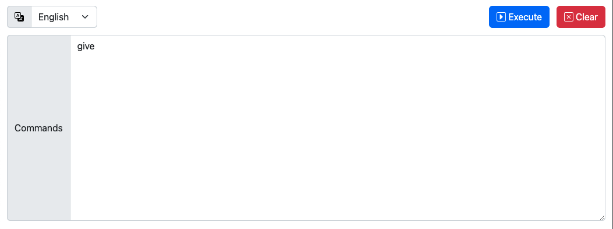

# Grasscutter-connector
[English](https://github.com/KennanChan/grasscutter-connector/blob/main/README-en.md)

本项目是一个nodejs服务器，可以将接收到的HTTP请求，转发到[Grasscutter](https://github.com/Grasscutters/Grasscutter)所在的Java服务，使得命令可以脱离服务器和游戏客户端执行。

Grasscutter-connector实际上使用了nodejs子进程启动了Grasscutter的Java服务。也就是说，Grasscutter服务需要由grasscutter-connector来启动

当grasscutter-connector服务器收到一条形如`["command1", "command2"]`的JSON数据时，它会解析这条信息并通过命令行逐条传递给Grasscutter服务

# 使用方法
## 启动服务
``` shell
node grasscutter-connector.js
```
支持的命令行参数:
```
--port: grasscutter-connector要监听的本地端口, 默认为9508
--jar: grasscutter对应的jar包的本地路径, 默认为"./grasscutter.jar"
--web: 是否提供Web发送页面. 可选项: "0", "1". 默认为"1"
```
## API说明
```
[POST] http://{server_host}:{server_port}/commands
headers: {
  Content-Type: application/json
}
body: ["command1", "command2"]
```

```
[WebSocket] ws://{server_host}:{server_port}/terminal
message(JSON string): ["command1", "command2"]
```
## Web发送页
Grasscutter-connector内置了一个如下图所示的命令发送页面

当grasscutter-connector启动之后，可以通过服务器地址和端口来访问这个页面（默认：http://localhost:9508）

 