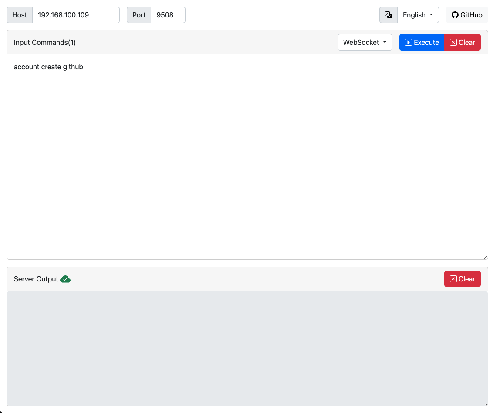

# grasscutter-connector
a nodejs connector to send commands to grasscutter java service via http.

grasscutter-connector wraps the grasscutter java service as a child process.

once grasscutter-connector receives an http post request with json array like `["command1", "command2"]`, it then passes the commands to grasscutter service via command line.

# usage
```shell
node grasscutter-connector.js
```
possible command line arguments:

--port: the port that grasscutter-connector listening to, 9508 by default

--jar: the grasscutter .jar file path, "./grasscutter.jar" by default

--web: serve the web page for command input and execution. candidates: "0", "1". "1" by default

## executor
grasscutter-connector is shipped with a web page for command execution

once grasscutter-connector started, visit the web page by the server address(default: http://localhost:9508)

 